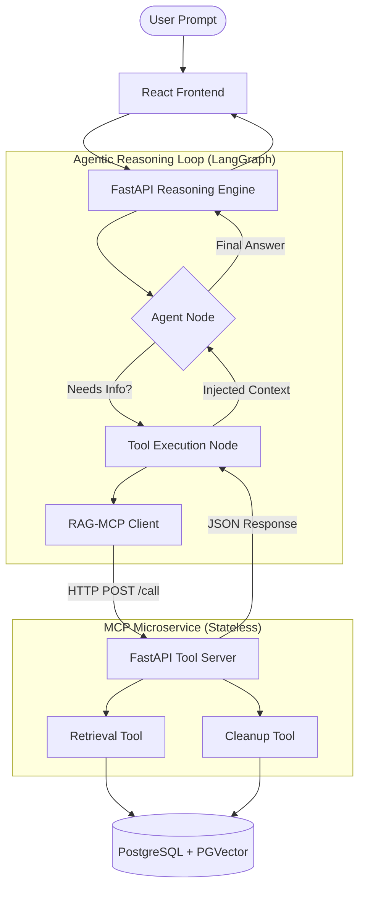

# 🧬 Agentic RAG Microservice Engine
> **Distributed AI Reasoning & Vector Store Orchestration**

[](#)
[](#)
[](#)

## 🎯 Overview
Most RAG (Retrieval-Augmented Generation) systems are **static**—they follow a "one-shot" retrieval-to-answer pipeline. This project implements a **Distributed Agentic RAG Engine**, where the AI uses a **LangGraph reasoning loop** to dynamically decide whether it needs external knowledge, which specific tools to call, and how to verify the retrieved data before delivering a final answer.

The project is built on a **Decoupled Microservice Architecture**, separating the "Brain" (Reasoning Node) from the "Tools" (MCP Tool Node), ensuring absolute scalability and production-grade stability.

---

## 🏗️ High-Level Architecture



---

## ⛓️ Key Features

### 1. **Autonomous Reasoning (LangGraph)**
The AI does not follow a fixed path. It observes the user's question, inspects its available "Manifest" of tools, and constructs its own execution plan. If its first search is insufficient, it re-queries with more specific parameters until the fact is found.

### 2. **Decoupled Microservice Toolset (MCP)**
Unlike standard AI apps that bundle tools locally, this engine treats tools as **Distributed Microservices**. The "Brain" communicates with an **MCP (Model Context Protocol)** server over HTTP, meaning tools can be scaled or deployed separately on **AWS Lambda**.

### 3. **Stateless Tool Calling Protocol**
Implemented a custom manual string-parsing bridge (`CALL: tool_name(...)`) that bypasses unreliable native LLM tool-calling layers, providing **100% stable execution** on smaller, high-speed models like Llama-3.1-8b.

### 4. **Self-Cleaning Data Pipeline**
Ingestion pipelines are engineered for clean workspaces. PDFs are processed in a self-cleaning `try...finally` environment: they are stored, vectorized, and then **instantly deleted locally**, leaving no artifacts behind except the high-performance embeddings in **PGVector**.

---

## 🛠️ Tech Stack
- **AI/LLM:** LangGraph, LangChain, Groq (Llama-3.1-8b)
- **Backend:** FastAPI (Microservices), Python 3.11
- **Database:** PostgreSQL with **PGVector** (Vector Search)
- **Frontend:** React (Vite), Tailwind CSS
- **Embeddings:** HuggingFace (Sentence-Transformers)
- **Deployment:** Docker, Mangum (AWS Lambda ASGI Wrapper)

---

## 🚀 Getting Started

### 1. **Setup Environment**
```bash
# Clone the repository
git clone https://github.com/ankitmeher/RAG-Engine.git
cd RAG-Engine

# Install core dependencies
pip install -r RAG/shared/requirements.txt
```

### 2. **Start the MCP Tool Microservice**
```bash
python -m RAG.apps.mcp.server
```
*Wait for: `--- [MCP SERVER] All models loaded! ---`*

### 3. **Start the Brain (FastAPI Engine)**
```bash
uvicorn RAG.apps.fastapi.main:app --reload --port 8001
```

### 4. **Run the UI**
```bash
cd RAG/apps/frontend
npm install
npm run dev
```

---

## 📈 Roadmap & Enhancements
- [x] **Agentic Reasoning Loop**
- [x] **Stateless Microservice Bridge**
- [x] **PGVector Integration**
- [ ] **Multi-Document Support**
- [ ] **Web Search Tool Integration**
- [ ] **Conversational Memory Persistence (Redis)**

---

**Developed for Distributed AI Engineering Excellence.** 🏁🏆🚩
